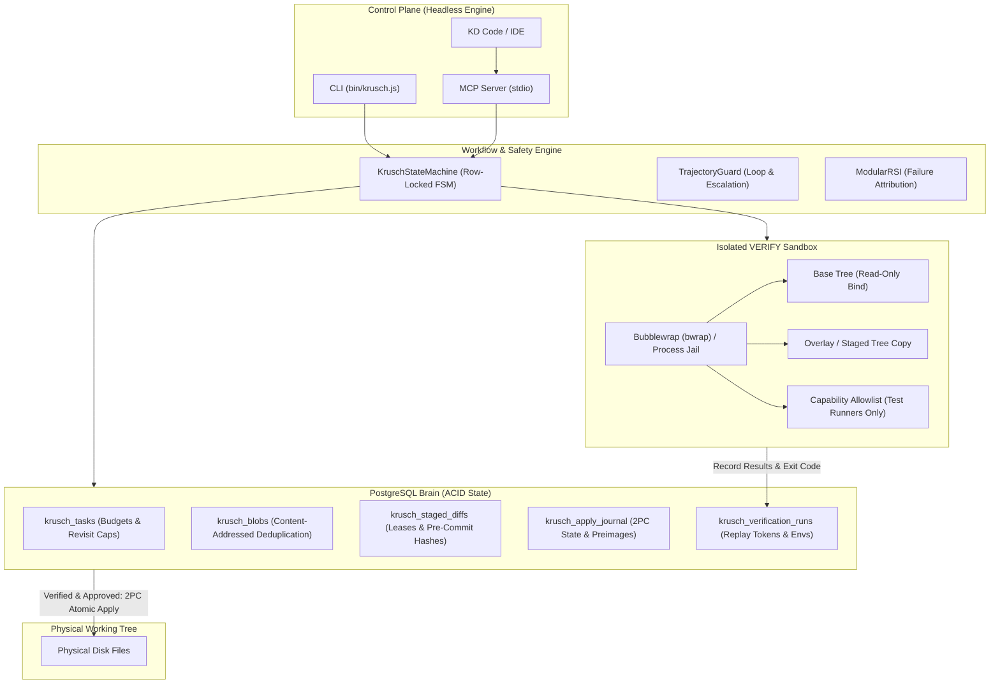

<p align="center">
  <strong>KRUSCH (v0.1.0)</strong><br>
  <span>PostgreSQL-backed coding harness that stages diffs, runs sandboxed tests, and only then writes to disk. Models are ephemeral workers.</span>
</p>

<p align="center">
  
  
  
  <a href="https://github.com/kruschdev/krusch/actions/workflows/ci.yml"></a>
  
  
</p>

> **Core Thesis**: *Models are ephemeral compute; PostgreSQL is the brain. Keep workflow, context, tests, and approvals consistent while making models interchangeable.*

---

## What You Get If You Only Clone `krusch`

When you clone this repository, you get a fully functional, self-contained headless execution engine with **zero external cloud API dependencies**:

```
┌────────────────────────────────────────────────────────────────────────┐
│                   IN-TREE CAPABILITIES IN THIS REPO                    │
├────────────────────────────────────────────────────────────────────────┤
│  ✓ Pre-Commit Staging Engine: SHA-256 content-addressed blobs         │
│  ✓ PostgreSQL FSM: Row-locked phase transitions (INIT ➔ COMMITTED)     │
│  ✓ Isolated VERIFY Sandbox: Bubblewrap (bwrap) / process jail          │
│  ✓ Capability Allowlist: Test runners only; freeform shells blocked   │
│  ✓ Two-Phase Commit Apply Journal: Crash-safe fsync + atomic rename    │
│  ✓ In-Memory Postgres: Zero-setup local evaluation via PGlite          │
│  ✓ AST Symbol Indexer: JS, TS, Python, Go, Rust structural symbols     │
│  ✓ Operator Controls: CLI/MCP abort, retry, reject, explain status    │
│  ✓ OpenTelemetry Spans & Cost Ledger: Audit trace JSON per task       │
│  ✓ Real PR-Ready Patch Export: Myers unified diff for git apply       │
│  ✓ Stdio MCP Server: 7-tool IDE bridge for KD Code or Claude Desktop   │
└────────────────────────────────────────────────────────────────────────┘
```

> [!NOTE]
> **Decoupled Architecture**: Sibling packages (`krusch-pre-router`, `krusch-cascade-router`, `krusch-context-mcp`) are **purely optional adapters**. This repository includes its own in-tree regex heuristic gate and deterministic mock adapter that run out of the box with zero external git dependencies or cloud keys.

---

## Architecture Diagram



---

## 🧭 System Principles & Invariants

1. **State Lives in PostgreSQL**: Primary task state, turns, events, and proposed file edits never live in transient scratchpads. All state persists to relational tables.
2. **Pre-Commit Staging Invariant**: File edits generated by models are staged into `krusch_staged_diffs` with SHA-256 validation. Physical disk files are **never touched** until tests pass and approval is granted.
3. **Hard Sandbox Isolation**: Verification does not run unconstrained on the user's checkout. It executes in a Bubblewrap container or process jail with a read-only base tree, memory/time limits, capability allowlisting, and process group termination.
4. **Actionable Failure Attribution**: Failures are classified into specific modules (`ContextManagement`, `ToolUse`, `ObservationManagement`, `AgentLoop`) using `KruschFailureClassifier` rather than blind re-prompting.
5. **Storage-Engine-Grade Apply Journal**: 2PC apply guarantees atomic multi-file commits, upfront drift detection, and idempotent crash recovery.

---

## 🚀 Quick Start (Zero Setup)

You can evaluate Krusch locally in **under 10 seconds** without installing PostgreSQL, Docker, or external API keys:

### Option A: In-Process Ephemeral Mode (Recommended for testing)

```bash
# Clone the repository
git clone https://github.com/kruschdev/krusch.git
cd krusch
npm install

# Run a complete verified task in-process using PGlite + Mock adapter
./bin/krusch.js run "Verify arithmetic module fix" --mock --ephemeral --auto-approve
```

### Option B: Docker Compose (Standard homelab deployment)

```bash
# 1. Start PostgreSQL 16
docker compose up -d

# 2. Bootstrap database, probe connectivity, and run migrations
./bin/krusch.js init

# 3. Run mock task
./bin/krusch.js run "Verify arithmetic module fix" --mock --auto-approve
```

---

## 🔒 The Safety Story: Hard Sandbox Isolation

Physical disk protection is meaningless if the verification step can escape and mutate the tree or leak credentials. Krusch enforces hard boundaries:

- **Bubblewrap Unprivileged Container**: Mounts the host and project root **read-only** (`--ro-bind / /`), isolates the network (`--unshare-net`), isolates process namespaces (`--unshare-pid`), and overlays the staged modifications.
- **Process Jail Fallback**: On environments where `bwrap` is unavailable, executes in a detached process group and kills the entire group (`SIGKILL`) on timeout or failure.
- **Capability Allowlist**: `run_command` and verification commands are restricted to recognized test runners (`npm test`, `node --test`, `pytest`, `cargo test`, `go test`, `vitest`, `jest`). Destructive shell patterns (`curl`, `wget`, `rm -rf`, interactive shells) are rejected before execution.
- **Durable Replay Token**: Every run records the sandbox type, environment snapshot, file manifest, command, exit code, and a deterministic SHA-256 replay token in `krusch_verification_runs`.

---

## 💾 Storage Engine & Apply Journal

The apply engine treats disk writes like database transactions:

```
[ PENDING ] ──(Verification Passed & Approved)──> [ APPLYING ] ──(fsync & rename)──> [ APPLIED ]
     │                                                    │
     │                                            (Crash Detected)
     │                                                    │
     └─────────────(Idempotent Crash Recovery)────────────┘
```

1. **Content-Addressed Blobs**: Identical file contents across tasks and turns are deduplicated in `krusch_blobs`.
2. **Upfront Drift Detection**: Before any file is modified, disk hashes are compared to original base preimages. If working-tree drift is detected, the entire batch aborts with zero disk writes.
3. **Atomic Multi-File Apply**: Files are written to temporary siblings, `fsync`'d to storage media, and renamed. If a crash occurs mid-batch, startup recovery inspects `krusch_apply_journal`, restores renamed files to base preimages, and removes orphaned temporary files.
4. **Idempotent Recovery**: Recovery operations can run multiple times without side effects.

---

## 🎛️ Operator CLI & FSM Controls

Krusch provides operator commands to unstick and audit tasks:

```bash
# Inspect task status, blocker explanations, and SQL invariant diagnostics
krusch status <taskId>

# Audit task trace as OpenTelemetry spans and token cost ledger
krusch status <taskId> --json

# Abort an active or stuck task with audit reason
krusch abort <taskId> --reason "Operator manual abort"

# Retry a task from VERIFY or IMPLEMENT phase
krusch retry <taskId> --from VERIFY

# Reject a staged diff
krusch reject <taskId> [diffId] --reason "Style violation"

# Inspect and export PR-ready unified diffs
krusch diff <taskId>
krusch diff <taskId> --export patch.patch

# Concurrency lease management
krusch lease list
krusch lease unlock src/calculator.js
krusch lease prune
```

---

## 🔌 Model Context Protocol (MCP) Interface

Krusch runs as a headless stdio MCP server for IDEs (such as KD Code):

```bash
./bin/krusch.js mcp
```

### Frozen Tool Protocol

| Tool Name | Phase Scope | Description |
|---|---|---|
| `krusch_run` | *Any* | Asynchronously initialize and run a task in PostgreSQL. |
| `krusch_task_status` | *Any* | Poll task phase, verification runs, active diffs, and blockers. |
| `krusch_explain` | *Any* | Explain next transition feasibility with SQL invariant tags. |
| `krusch_diff` | *Any* | Retrieve unified diff of staged modifications. |
| `krusch_reject` | `APPROVAL_GATE` | Reject a staged diff before application. |
| `krusch_abort` | *Any non-terminal* | Abort a task and record the operator reason in `krusch_events`. |
| `krusch_apply_diff` | `APPROVAL_GATE` | Commit verified staged diffs to disk via the 2PC journal. |

---

## 🧪 Verification & Test Suite

The test suite exercises unit behavior, storage engine properties, sandbox isolation, and PostgreSQL integration:

```bash
# Run fast unit tests (AST indexer, router heuristics, sandbox allowlist, RSI)
npm run test:unit

# Run storage engine property & PostgreSQL integration tests
npm run test:integration

# Run full test suite (79 tests across unit, integration, and ephemeral)
npm test

# Verify TypeScript declarations (zero errors)
npm run typecheck

# Check package manifest and npm pack contents
npm pack --dry-run
```

---

## 🚫 Non-Goals

To preserve reliability and prevent architectural bloat:
1. **No IDE or GUI components**: Krusch is a headless execution engine. KD Code or Claude Desktop serves as the UI control plane.
2. **No required external routers**: Routing is decoupled behind `src/router/interface.js`. The in-tree heuristic gate runs with zero external dependencies.
3. **No direct disk mutations**: All mutations must proceed through `stage_diff -> sandboxed VERIFY -> APPROVAL_GATE -> 2PC apply`.
4. **No shell execution in IMPLEMENT**: Freeform shell commands (`run_command`) are strictly forbidden during `PLAN` and `IMPLEMENT` phases.
5. **No unconstrained agent loops**: Phase revisit budgets cap oscillation between `VERIFY` and `IMPLEMENT` to prevent runaway spending, automatically escalating or aborting tasks that do not converge.
6. **No client-side state authority**: Ephemeral model context windows cannot override database invariants; PostgreSQL triggers, row locks, lease TTLs, and transitions are the sole source of truth.

---

## License

MIT © 2026 Kevin Ruschman (KruschDev)
